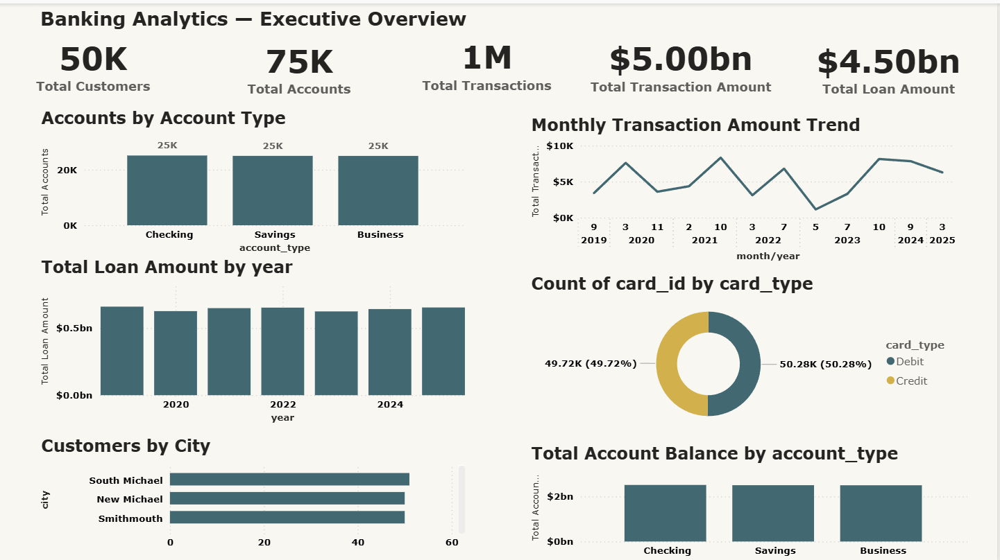

# 🏦 Banking Analytics — End-to-End Data Analytics Project

An end-to-end banking analytics project covering data cleaning, SQL analysis, Python EDA, Microsoft Fabric data engineering, Direct Lake semantic modeling, and Power BI reporting.

The project analyzes banking data across customers, accounts, cards, transactions, loans, merchants, and branches.

## 📊 Power BI Report Preview



The Power BI report provides an interactive view of key banking metrics and business insights.

---

## Project Architecture


## 🎯 Project Objectives

- Analyze customer demographics and credit scores
- Analyze account balances and account types
- Analyze transaction activity and transaction amounts
- Analyze loan amounts and interest rates
- Build a scalable data architecture using Microsoft Fabric
- Create a business-ready semantic model
- Develop an interactive Power BI report

---

## 🔄 End-to-End Workflow

```text
Raw Banking Data
       ↓
Excel
       ↓
Data Cleaning
       ↓
SQL Server
       ↓
SQL Analysis
       ↓
Python
       ↓
Exploratory Data Analysis
       ↓
Microsoft Fabric
       ↓
Bronze → Silver → Gold
       ↓
Direct Lake Semantic Model
       ↓
Power BI
       ↓
Interactive Banking Analytics Report
